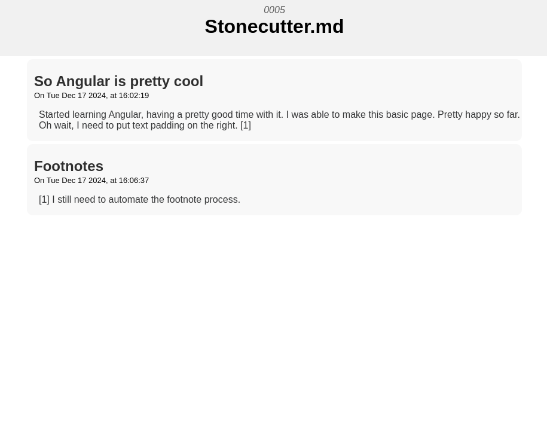
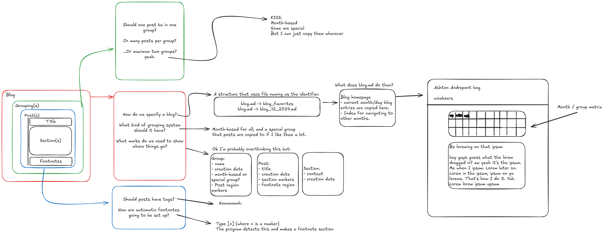
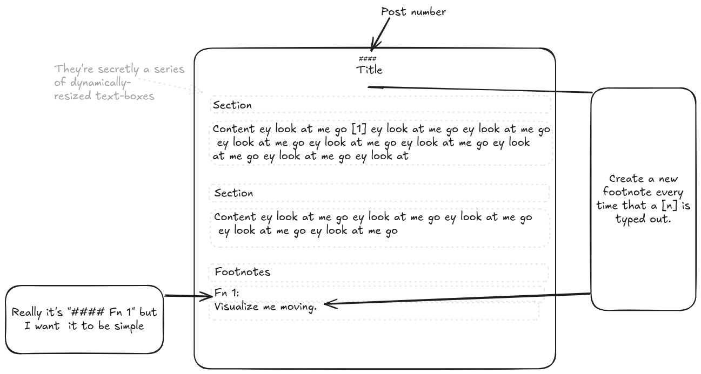
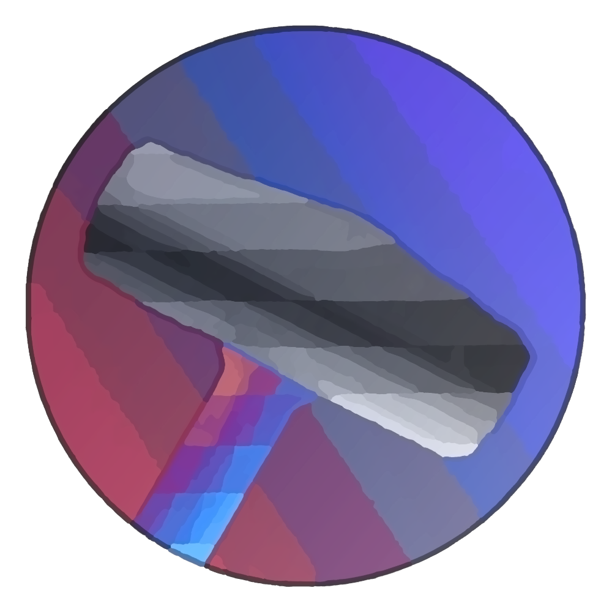

# Blog

<table>
      <tr><td> <a href="/index">Home</a> </td><td><a href="/blog">Blog</a> </td><td><a href="/other_stuff">Other Stuff</a></td></tr>
</table>

---

## WOEK

## This is the FIRST ONE! YEAHAHHHHH

hi

## This is the FIRST ONE! YEAHAHHHHH

hi

## It's ALIVE!

After a long time of applying to jobs and getting a side job (without even a main job yet :/ ), on the one snowy day in many years I have taken up my offer and encroached upon my self the task to do that shit and make it happen. And it works! I am very happy.

## Next up:

I forgot to add support for footnotes. This is pretty bad on my part. I'll get to that.

For now in my life, I will be annotating data as a work-from-home job until I can get a work-outside-of-home job that pays-more-than-minimum-wage-without-degrading-my-sense-of-self-like-that-time-I-worked-in-a-pizza-kitchen-,-but-I-still-remember-how-fun-it-was-despite-how-sad-I-was.

Anyway, I'm gonna go do stuff now.

## New Section

hi
## 0011: New Year, Less Teeth, Burned Stuff, Ballin'
---

***New Year*** On Wed Jan 01 2025, at 12:44:34

Happy new year!
I spent the days before the new year at my boyfriend's grandmother's place. (I love him so much)

December was 2/3rds "I hate everything" and 1/3rd party. Finals and drama and a birthday I didn't have time to celebrate in the first 2/3rds, then graduation, Christmas, Christmas II, Christmas III, and Christmas IV, all with different parts of the family.

I love my family, but at the same time I'm quite happy that all the partying is over.

Time for ... forced rest.

***Less Teeth***
Finally got rid of the competition; but now I'm only left with stupid teeth.
Wisdom teeth are not fun to have in your mouth. My congratulations to those who don't need to deal with them. My condolences to my fellow sufferers.

I've been too sedentary. I want to move around. But I can't!

...

When I get the chance, I want to go to the library.

***Burned Stuff***
Burned a paper full of thoughts I wanted to leave behind. And... it worked.

...Pretty glad. :)

***Ballin'***

All that's left for me to do now is make the most of the year.

Theoretically I wouldn't need a whole section dedicated to just this, but I like it.

***Oh right, StoneCutter***

I'm gonna rework it. So far the alpha build has taught me a lot about Angular, but I feel like I'm going about developing it wrong.
Wish me luck!

## 0010: A thought about microwaves
Many American homes have a microwave in them. It's a convenient cooking apparatus that allows for many foods to be re-heated with very little effort. However, most food that comes out of a microwave is unhealthy, and tastes worse than if it was stove cooked. The oils and salts needed to make microwave-cookable foods taste good exceed dietary standards, and the method of re-heating by exciting the water particles causes a significant drop in taste quality. In this blog post, I explore the concept of forcing oneself to eat healthier by not having a microwave.

## 0009: Hope
---

***I know I can do it. I know I'm qualified.*** On Mon Dec 23 2024, at 12:46:24

...but does it matter?

Worries like this can hurt a lot. It conflicts with the values that come from an identity. I see myself as a smart person. Not getting into a certain place or field doesn't make me dumb, but it does make me upset. To put so much of my identity on the line is scary when it comes to big decisions.

Ironically, posting up for so many jobs helps me take away that fear.

It gives me a bunch of reasons to reflect on everything that I'm good at. Yeah, I presented at that symposium! Yeah, I did data analysis for a bunch of colleges [[1](####_0009_fn_1)]! Yeah, those hobbies I have, they can come in useful in this niche of a job!

I have a bunch of reasons to see myself in a good light. And if I'm applying to a bajillion [[2](####_0009_fn_2)] companies, then I don't need to worry too much about missing one.

I just hope I can make like, one.

...

I need to admit, that fear never goes away. With the sudden job market switch-up in computer science, I wouldn't be surprised if job insecurity defines my young adult life.

C'est la vie, though. Gotta stay strong.

I have promises I need to keep.

### Footnotes
#### 0009 Fn 1

And I was damn good at it too.

#### 0009 Fn 2

Contrary to the last post, I am not going to argue on this one.

## 0008: Post Graduation Blues
---

***The Part Where There's Nothing Again*** On Sun Dec 22 2024, at 13:08:52

Well there's like, Christmas I guess.
But I don't have a job lined up, I don't know where I'm going to grad school at yet, 
it's the holidays but I feel too antsy to sit at home and do nothing. I thought that 
I could stow the antsyness [[1](####_0006_fn_1)] by having topics to study, but I still need money for 
grad school. I'll *try* for something in comp sci but I have little hope until the summer. Until then, 
some part time job would be nice.

### Footnotes
#### 0008 Fn 1
Not a real word apparently; it has a red squiggly line in stonecutter [2].

#### 0008 Fn 2
"stonecutter" is also not a word, but "Stonecutter" -oh, nevermind [3] that's also not a word.

#### 0008 Fn 3
Oh come on, I am certain that "nevermind" is a word. Who wrote this dictionary?

#### 0008 Fn 4
[Kurt Cobain did, apparently.](https://kris-spisak.com/episode-1-never-mind-vs-nevermind/)

## 0007: Stonecutter.md, Part 3
---

***New Section*** On Thu Dec 19 2024, at 09:00:03

Stonecutter is coming along great! I was able to make this text in it. Hope it generates correctly on the site... [[1](#0007-fn-1)]

### Footnotes
#### 0007 Fn 1 
Woo!

## 0006:

## 0005:

## 0004: I should make an editor for my blog.
**December 16, 2024 - Monday**

Don't get me wrong, I love markdown, but I'm doing this in VS Code. And don't get me wrong, I love VS Code, but I kinda want something more special.

Hmmmmm

I mean there's probably software out there, but this sounds like a good project.

I'll go for a walk and think of a name.

_**A short time later...**_

So I made this graph that details the basic plan for how I want to organize everything, but I still don't have a name.

I'll go on another walk.

_**A longer time later...**_

Ok so I found a good name and a simple idea for a layout.

_Stonecutter\.md_ sounds good. It's meant to cut what would end up being a monolithic markdown file into much smaller chunks.

The layout is as simple as possible.

And yeah, I realized that this just looks like obsidian. But whatever, I just want a special tool to use.

I guess I need a logo too, huh...

_**One GIMP window later...**_

boom.

I'm hungry now, I'm gonna make some food.

## 0003: Oh yeah, a job. I forgot about that.
**December 14, 2024 - Saturday**

Thought of the day: "...Well crap."

I'm not quite sure if I'll be able to get a job between now and grad school.

I _could_ go work with my uncle, and it'd certainly be a fun job, but it's not in my field.

...

I tried networking a bit today. The market is difficult for everyone right now, this is to be expected, but now I'm just wondering what I might do if I can't.

I've had this idea in mind. Making a software for comprehending research papers. Maybe it can be really good, who knows.

Either way, it can be great for a portfolio.

...ugh. Job security.

**December 15, 2024 - Sunday**

I wonder if any cartels are hiring...

I would love to see a movie about a man trying to get hired in software development, when a 
group of bank robbers / thugs push him to the ground. He offers his resume and gets hired.

...who in the world is hiring?

## 0002: Huh, I'm Really Almost Done
**December 12, 2024 - Thursday**

My last final is tomorrow.

I guess I need to go to grad school; I don't feel quite satisfied with what I know just yet. 
I want to be more specialized. That will come in time though -- I'm still waiting for acceptance letters.

**December 13, 2024 - Friday**

My last final is today now.

Kinda dreading it. Not because it's hard or because it's for a particularly... *special* class, 
but because it's at 5 p.m. and I don't have other plans yet.

***At lunch, on the same day***

I got a goodbye letter from my friend Gabriel [[0](#0002-fn-0)] earlier. I might frame it. 
Wrote one back to him. I'm smiling right now.

I'm waiting for a friend to join me for lunch right now; part of me feels like I should be studying but the other part of me is incendiary and is simply too tired to fight the feeling of all-consuming disgust and recurring feelings of when I study for this class.

***In Oliver Hall, T-minus 4 hours and 13 minutes until final***

I'll be gone soon. Very soon I won't need to think about this class.

...When I'm done, will I feel satisfied? Will I feel like I completed something? Or will I feel like I escaped something? Did I overcome an obstacle or serve an undeserved sentence?

...

Anyway, I'm writing thank-you letters to faculty. It's a pleasant experience.

***Afterward***

It was so easy.

I'm so tired.

I'm done.

I'm really done...

***Post-Afterward***

It felt kinda wrong that it was easy; I had put a lot of effort into studying and it turns out that the final was half of the topics we studied.

Now that it's not the minutes after finishing the final, I'm doing much better. Honestly I'm glad it wasn't difficult; everyone had the thought that it would be needlessly unfair.  

It's... oh, one second.

**December 14, 2024 - Saturday**

It's 12:12, I'm staying up on a call with my boyfriend and listening to his college's radio. [[1](#0002-fn-1)]

I'm having a good night.

---
### 0002 Footnotes
#### 0002 Fn 0
No idea if you're reading this, but I know you got my letter nontheless. Many, many thanks.

#### 0002 Fn 1
Kudos to KLPI! The current song playing is "Sure that you're the Northern Star." Oh, it switched to landslide.

Not sure how much of a devil of details you are; I listened to the Smashing Pumpkins version of this song first. I grew up on 90's music actually; my mom made us listen to her CDs.

## 0001: First Entry: Exit
**December 10, 2024 - Tuesday**

I'm graduating soon. Like, 10 days soon. Part of me is excited. The other part of me is gonna need to adapt pretty quickly. And so I spent some time last night writing out a plan for the six months I have between now and grad school [[0](#0001-fn-0)].

It boils down to two things:
- Get a job.
- Research.

The job part is tricky right now; I've applied to places before. I would *imagine* I'm quite qualified for the places I apply to given my resume, but so far I have had no luck in finding work except for the DADL Lab.

The research part is easy [[3](#0001-fn-3)] -- I want to look at more research papers [[1](#0001-Fn-1)]. It would be especially helpful to look at research papers once I get into grad school [[0](#0001-fn-0)].

---

### 0001 Footnotes
#### 0001 Fn 0
Fingers crossed in this economy.
#### 0001 Fn 1
I actually have a bucket list:
- Education/AI papers, from places like the iSAT lab at CU Boulder. [[2](#0001-fn-2)]
- Modern pedagogy papers from Harvard and other schools that study pedagogy.
- Random crap that catches my interest.

#### 0001 Fn 2
I suggest that everyone looks at [this paper](https://par.nsf.gov/servlets/purl/10284384), because it prescribes a very simple way to make much more readable texts.

#### 0001 Fn 3
By comparison, of course. With how jobs are looking right now, reading and reviewing is notably easier.

---

Oh hey, it's the bottom of the page. Hi!
