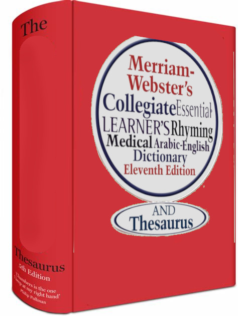
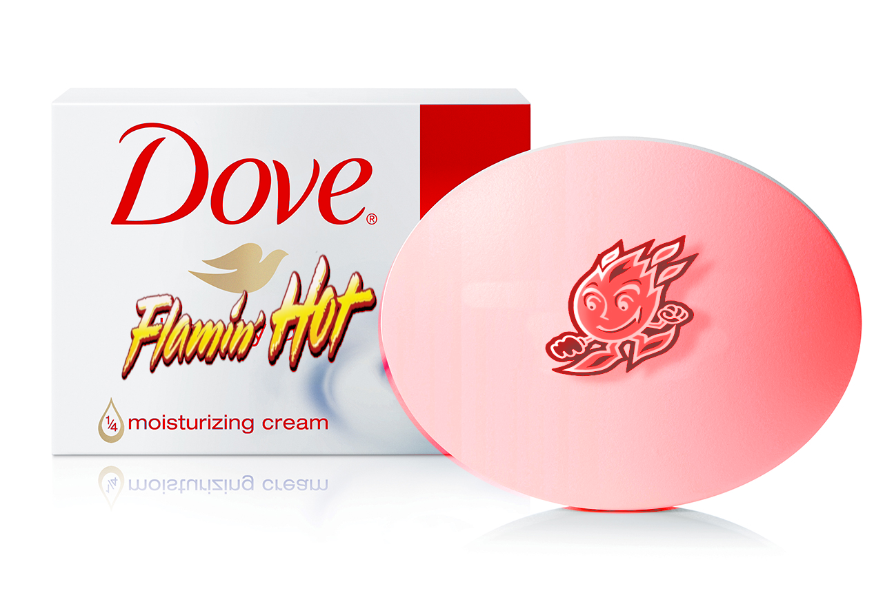
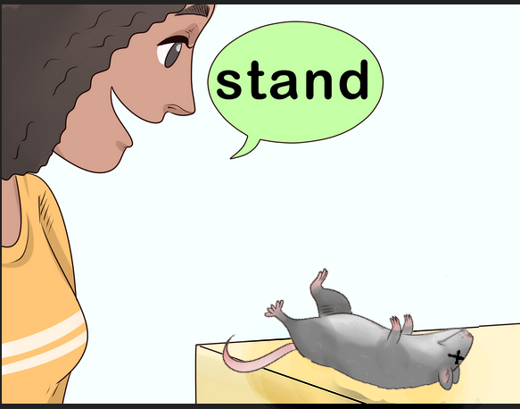
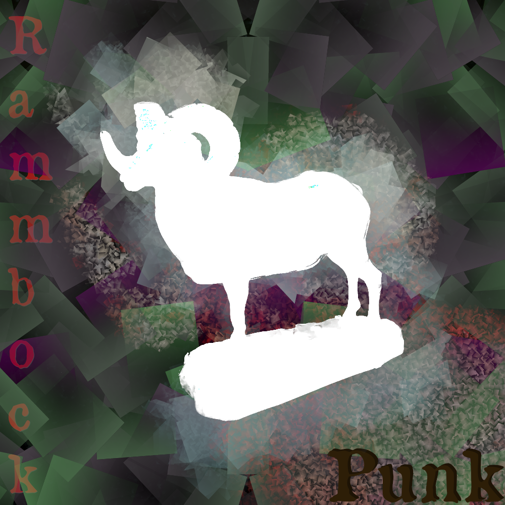
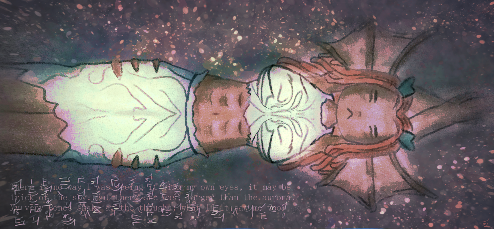

I've been using GIMP for 8 years, ever since I first installed Linux and realized it didn't come with MS paint.

I hear a lot of people say it's "unintuitive," when really all you need to do is change the default layout and it becomes a cakewalk.

Before I started making art, I would use it for much less... demanding tasks.

Once I had the hang of it, I got into designing some art

---

Later on when I finally started drawing, my knowledge of image effects and layers allowed me to make much more expressive works:

Now most of my art is done in Krita first, and then touched up later on in GIMP.