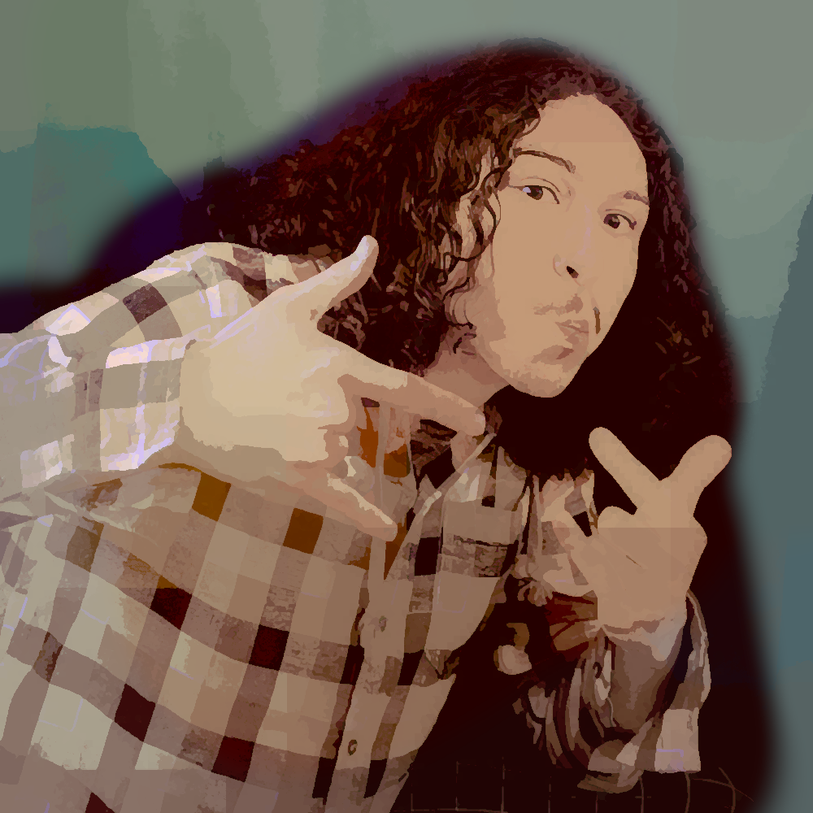

# About

Software architect and team lead with a focus on educational technology and accessibility. Currently pursuing an M.Ed. in Innovative Design and Technology in Education at Vanderbilt University.

My experiences with educational technology in Louisiana inspired me to work on systems that actually help students learn. I believe technology should make learning more accessible, not more frustrating.

I hold a BS in Computer Science from the University of Louisiana at Lafayette, graduating magna cum laude (3.83 GPA) in 2.5 years. I completed undergraduate research and presented at IBM Thomas J. Watson Laboratory. I am currently pursuing my M.Ed. at Vanderbilt University as a Dean's Merit Scholar.

# Technical Skills

Python
Django
JavaScript
TypeScript
C#
Blazor
React
HTML/CSS
SQL
Git
Azure DevOps
Docker
Machine Learning
Computer Vision
CNN
Curriculum Learning

# Experience

## Lead Fullstack Developer - BeNakama
**EdTech • Fullstack Development • Azure DevOps** | *February 2025 - January 2026*

Led development of an advanced, secure classroom system and educational video game (Ascend) for UK high school students. Designed and implemented a smart question system that adapts to student ability, with specific accommodations for students with learning difficulties and disabilities. Managed Azure DevOps, ensured website uptime, and tested/debugged update launch issues. Utilized C# Blazor for fast, responsive interactions and seamless full-stack integration.

## AI Annotation Contractor - DataAnnotationTech
**AI/ML • Model Evaluation** | *January 2024 - Present*

Created high-cognition, model-challenging questions that exposed weaknesses in AI mathematics models. Designed and rigorously tested AI chat modes across multiple functions and interactions. Gained key insights into common AI model pitfalls and recurrent issues across models and versions.

## AI Researcher - ULL Data Analysis and Deep Learning Lab
**Machine Learning • University Research** | *September 2023 - December 2024*

Presented research on image classification training methods at the IBM Thomas J. Watson Laboratory as part of AICS'24. Principal researcher in applying curriculum learning to image classification convolutional neural networks. Designed and implemented a wavelet decomposition algorithm enabling classification research and providing insight into image data complexity.

## Tech Lead - Aluminotes
**Team Leadership • Accessibility • Fullstack Development** | *January 2024 - December 2024*

Led a 3-person development team building an AI-leveraging note-taking app to assist students with disabilities by reformatting and rewording text. Full stack development using Django, HTML, JavaScript, and Python. Won 1st place in Inn-eaux-vate pitch competition.

# Focus

I'm interested in educational technology that actually helps students learn, especially students with learning difficulties or disabilities. My approach is shaped by personal experience with educational systems that prioritize compliance over learning.

# Interests

Currently exploring how technology can make education more accessible and effective, particularly for underserved students. Interested in the intersection of human-computer interaction and learning systems.

