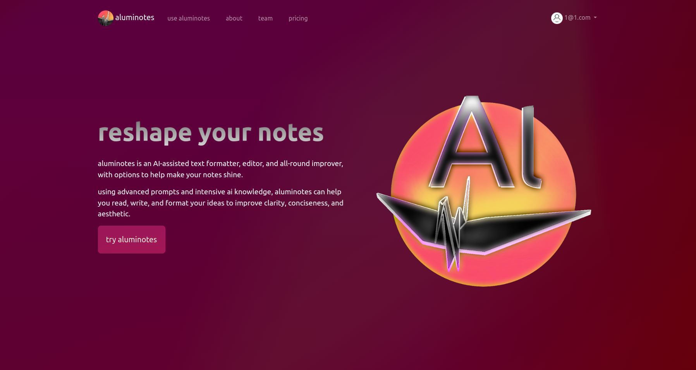

 <video width="100%" height="auto" controls>
  <source src="Aluminotes/aluminotes_one.mp4" type="video/mp4">
  <source src="Aluminotes/aluminotes_one.ogg" type="video/ogg">
</video> 

My friends and I with ADHD couldn't keep up with traditional note-taking—our notes were broken and useless by the end of lectures. So we built Aluminotes: an AI system that recognizes messy notes and transforms them into structured, reviewable summaries.

---

We built it on Django using Google Gemini. The system takes shorthand notes and outputs coherent lecture summaries with proper structure and context. We tested it on ourselves - being our own users let us focus on real pain points instead of guessing.

---

We won first place at our school's Inn-eaux-vate pitch competition. But the real win was proving something I still believe, and that I find myself lucky to experience: EdTech works best when built by people who actually experienced the problem. Because we were the users, we knew what to solve and improve.

---

You can find the code at https://github.com/DudeSquaredEdud/Aluminotes

(Aluminotes.net is, sadly, now defunct)