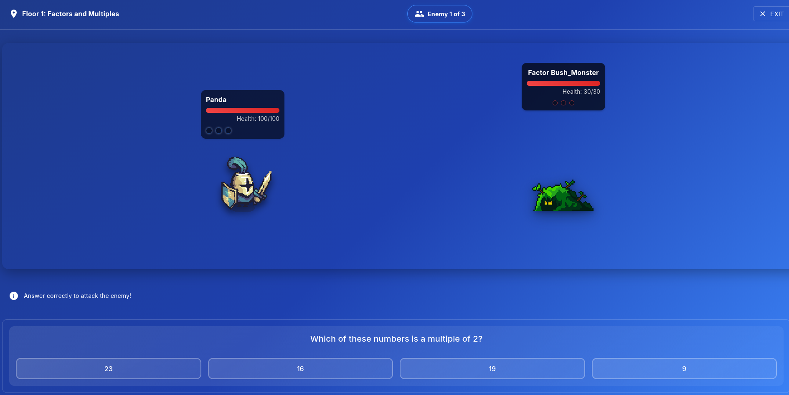

After my undergraduate research on curriculum learning, I wanted to apply those principles at scale. I sought a position where I could implement adaptive learning systems that balance challenge and engagement - the core insight I gained from Dr. Stephens' class. BeNakama's mission to prioritize genuine learning over compliance metrics aligned perfectly with my philosophy.

---

As fullstack engineer, I work across the entire stack to build Ascend's combat and adaptive difficulty system. I lead backend design remotely, architecting systems that track student performance across mathematical concepts and adjust problem difficulty in real-time. 

The RPG format keeps students engaged while the underlying algorithms ensure they're working at their optimal challenge level. I'm involved in both the design decisions and implementation, allowing me to ensure the technical architecture serves the pedagogical goals.

---

Ascend represents my first professional implementation of research-backed adaptive learning. The system is designed to identify individual student strengths and weaknesses, then use that data to create personalized learning pathways. My goal is to prove that technology can scale the kind of personalized, challenging, engaging education I experienced at LSMSA to students in UK high schools and beyond.

---

You can sign up at https://play.benakama.com