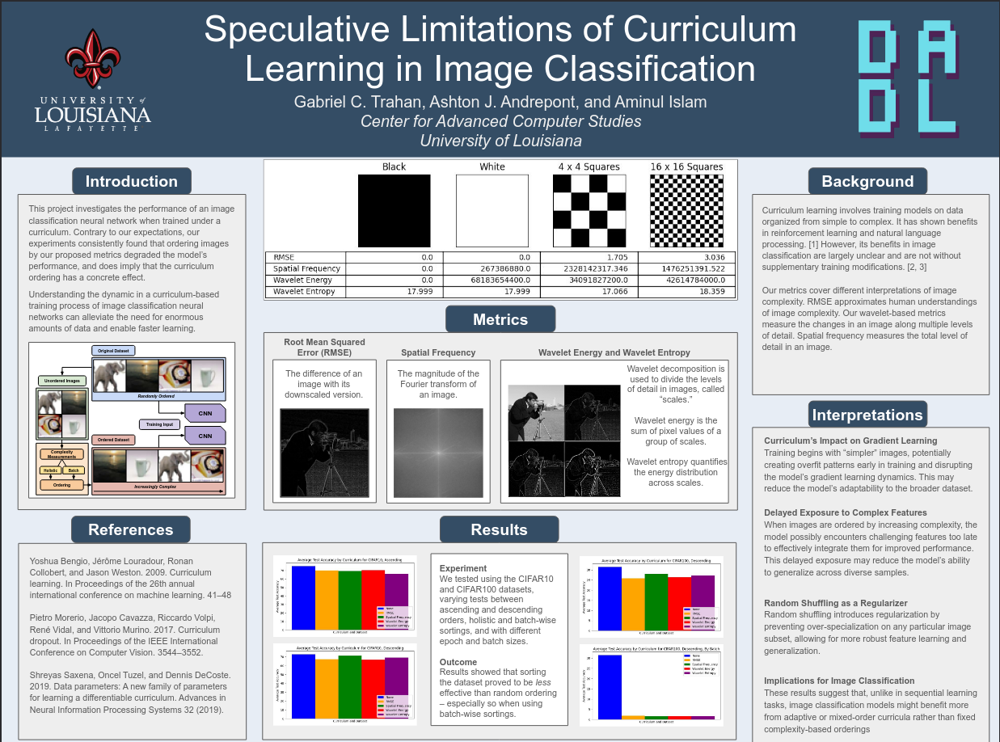

I wanted to understand: what makes an image hard for a neural network to classify? I used wavelet entropy as a measure of image complexity, then tested whether ordering training by difficulty improves learning. Presented at IBM's Thomas J. Watson Laboratory.

---

Although I had help out in the DADL lab before, this was the first project where I was more in the know about the process than the other researchers. Wavelet complexity was brought up in a meeting after thinking about my favorite GIMP image effect, "wavelet decomposition". 

My mentor at the time, Gabriel Trahan, had experience in signal theory. He knew that wavelets were used as a means of extracting signal from noise, but had never thought about them in an image context. I knew about them from the image point of view, but never knew how they worked.

I used a math technique called wavelet entropy to measure how 'complex' an image is for neural networks. Initial testing showed promise, but an unnoticed grouping in the data made results worse overall. I'm still proud of this work - it taught me something crucial: simple details matter more than big theory. That lesson changed how I approach research.

---

I am still proud of the experiment and I even have the poster on my wall. I believe I learned a valuable lesson on how simple considerations are often lost when thinking about the big picture.