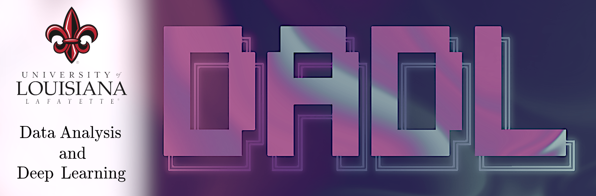

Undergraduate research on optimal training order for image classification neural networks, using wavelet entropy as a proxy for the difficulty for a neural network to successfully classify a given image. Presented these findings at the IBM Thomas J. Watson Laboratory.

---

Although I had help out in the DADL lab before, this was the first project where I was more in the know about the process than the other researchers. Wavelet complexity was brought up in a meeting after thinking about my favorite GIMP image effect, "wavelet decomposition". 

My mentor at the time, Gabriel Trahan, had experience in signal theory. He knew that wavelets were used as a means of extracting signal from noise, but had never thought about them in an image context. I knew about them from the image point of view, but never knew how they worked.

In short, wavelet decomposition is a more advanced edge detection algorithm that matches along directions and scales. These directions and scales are "taken out" of the image, for the process to be repeated. This allows you to capture details about the image that are not visible when all the scales are presented together.

We had decided to use wavelet entropy, a special method of calculating the difference between scales, as the proxy for image complexity. Initial testing showed promising results, but an oversight - unnoticed groupings - had resulted in the model performance to be worse overall.

---

I am still proud of the experiment and I even have the poster on my wall. I believe I learned a valuable lesson on how simple considerations are often lost when thinking about the big picture.