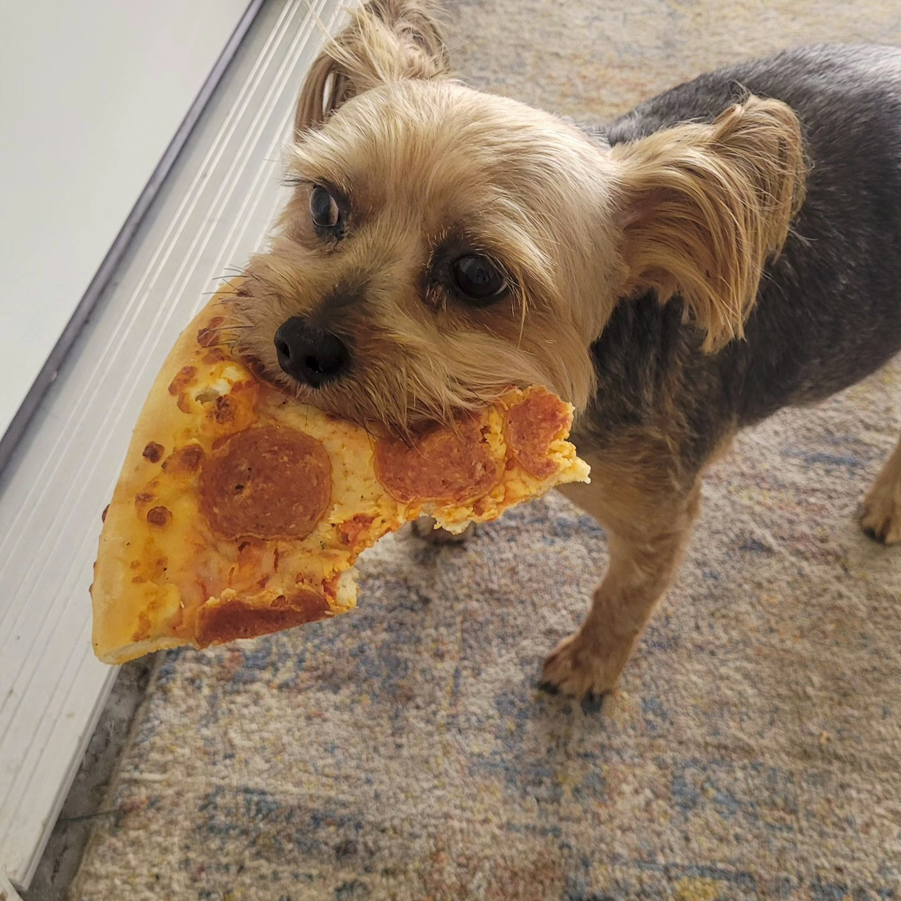
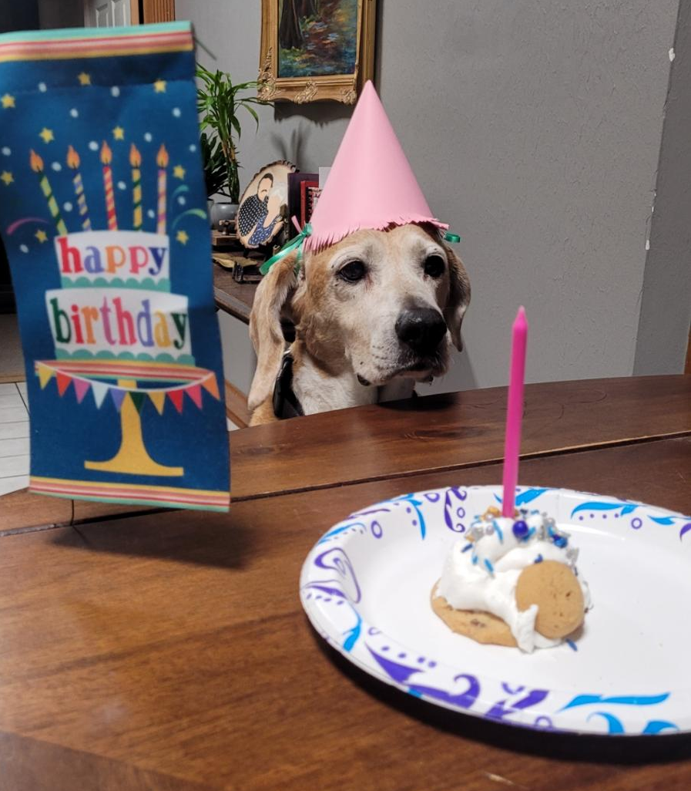
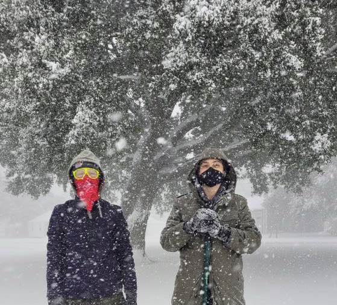
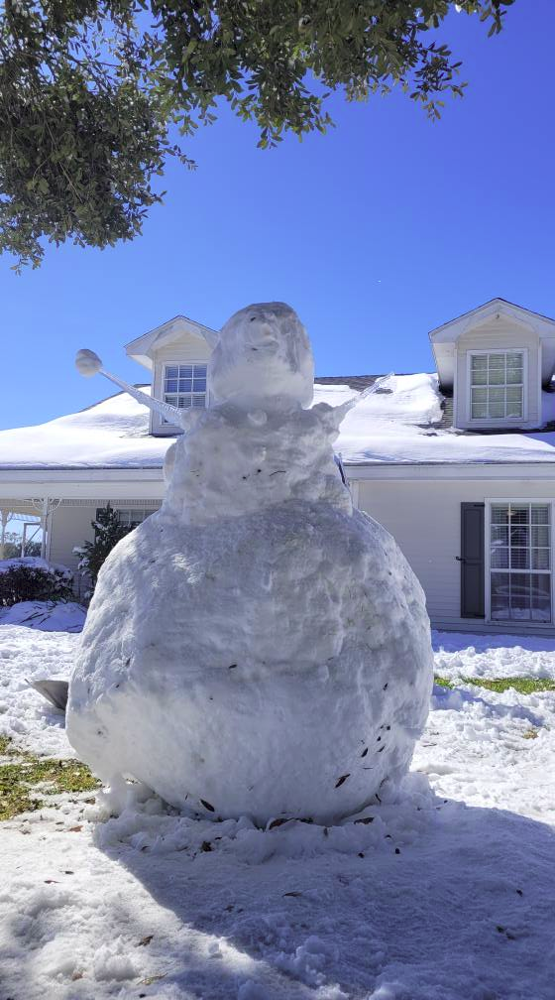

# Random Stuff

This is just a page full of images of things I care about, but they don't have much to do with my professional life.

## Dogs

### Drew
This is my dog Drew. He's really cool, and you can tell he's really cool because he's eating a WHOLE pizza slice.

    

We didn't let him eat it of course, because it's way too much for him and it's also pretty bad for his little stomach.

He spends his time sitting around and pouting. He enjoys his toy moose and hates the pool.

### Gracie
Gracie was the dog I grew up with. She was like a really annoying sister that hated anything that moves.

    

She didn't actually eat the cookie because it was also not safe for dogs. We gave her a treat and some whipped cream.

## Snow

In Louisiana, if we're really lucky we get _sleet_, and that's only sometimes. 

So when the weather report said we would get snow, nobody believed it at all.

...

THEN WE GOT THE SNOW!!

    

I never thought I'd see snow actually falling until I moved to another state.

    

I even got to make a snowman! :D

I am childishly excited about snow. I hope I can live somewhere with a lot of snow some day.